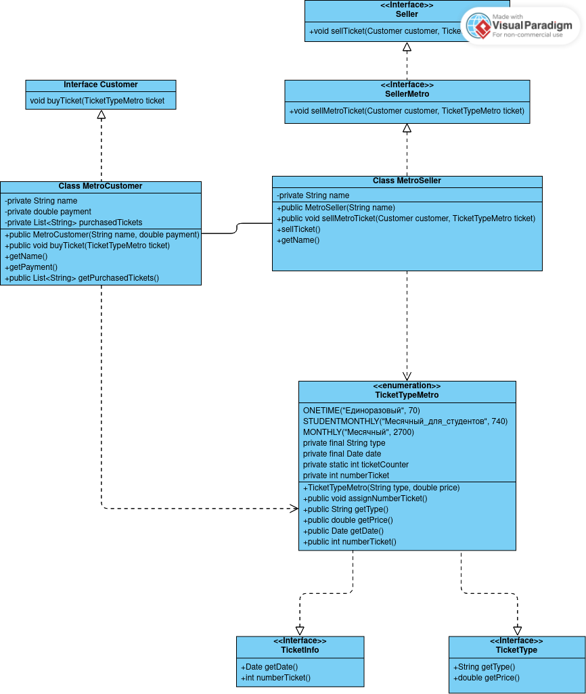

### классы продавец/покупатель/билет наследуют и реализуют интерфейсы. MetroCustomer и MetroSeller взаимодействуют друг с другом во время покупки билета, 
### каждый из них взаимодействует с билетом, один покупает определенный билет, другой этот определенный билет продает
### у покупателя имеется хранилище купленных билетов, видимо коллекционирует их)
### отступил от диаграммы с семинара, чтобы самому подумать как это можно сделать
### как я понимаю, контрактное программирование подразумевает контракт на выполнение каких-то условий, 
### а реализация интерфейса и есть контракт на выполнение его методов

